# linux-commands

## Those are example of  some linux commands
### They are:

- sudo commands: it used to carried out special permission on files or directory with security privileges on root directory.
- mkdir commands: it used to create new directory or directories.
- cd: it use to change from one directory to another.
- ls: it is used to list files or directories.
- pwd: it is used to show the working path of directory.
- cp: use to copy files.
- touch: to create files.
- mv: it is use to move or rename files.
- rm: it use to remove files or directory.
- find: it use to look for a files.
- /: is the root directory.

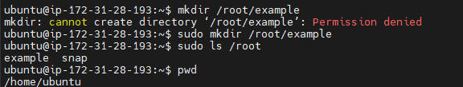

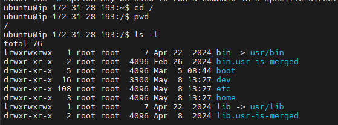

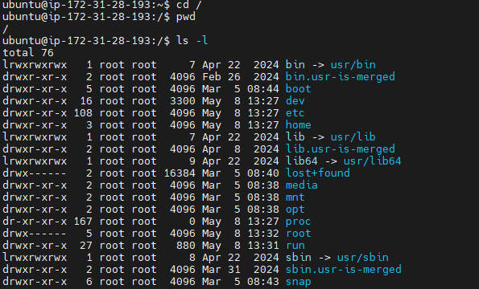

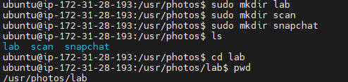

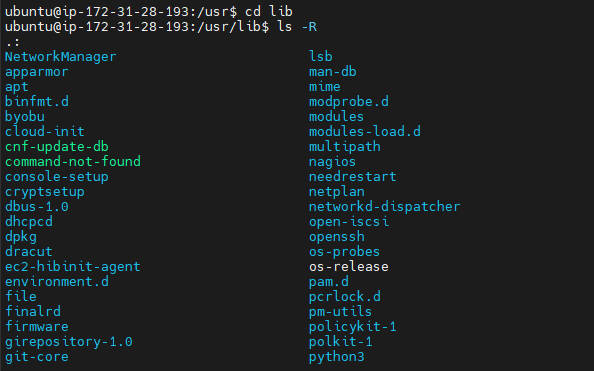

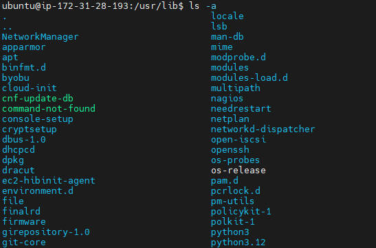

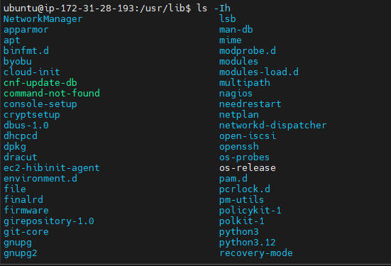

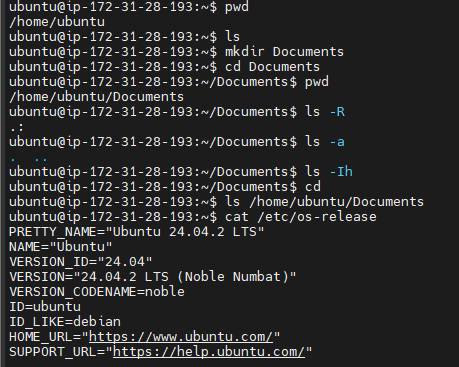

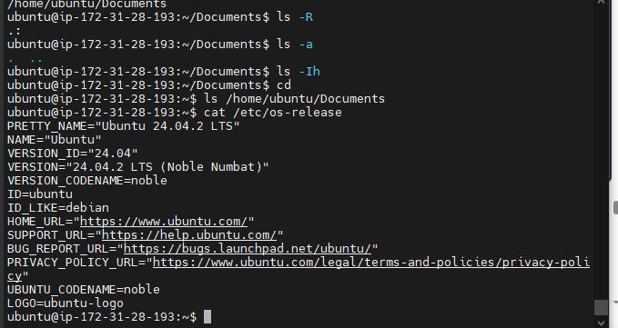

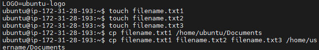

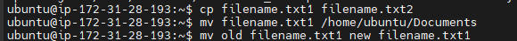

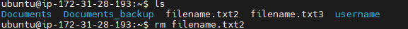

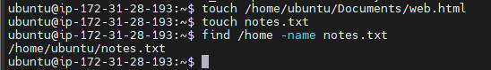

